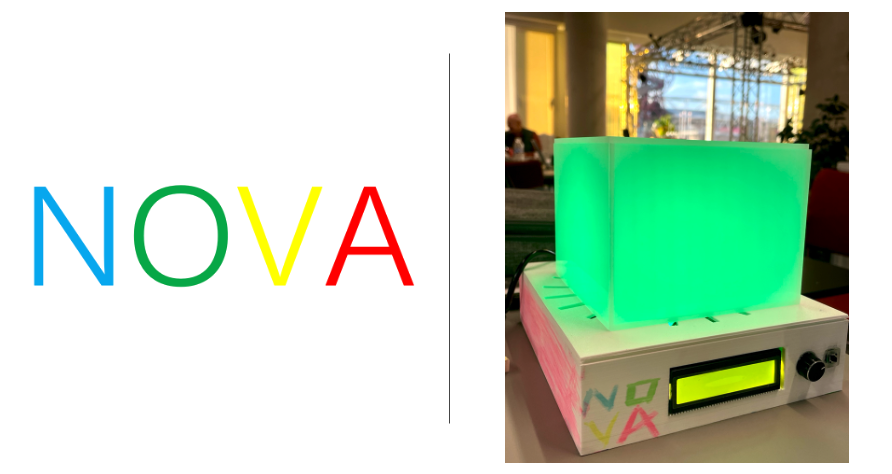
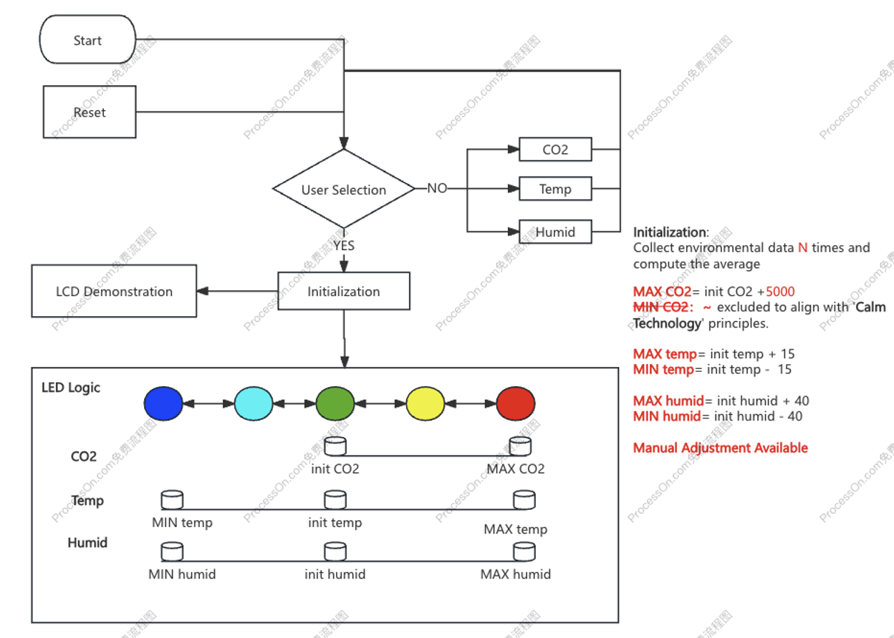
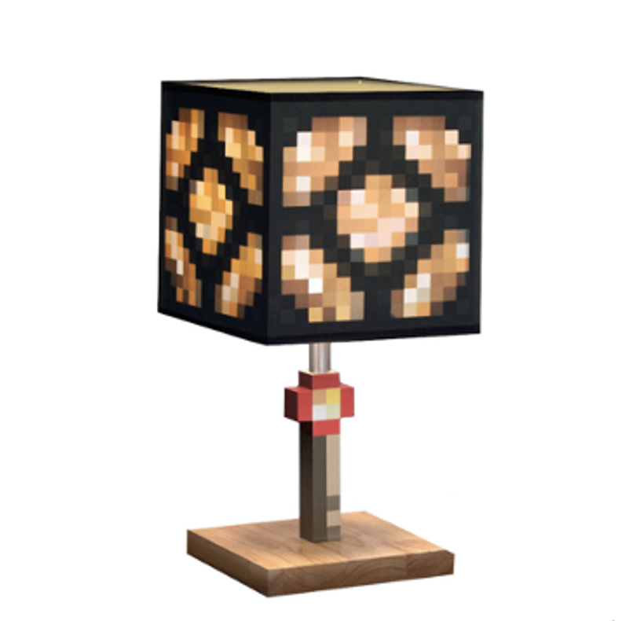
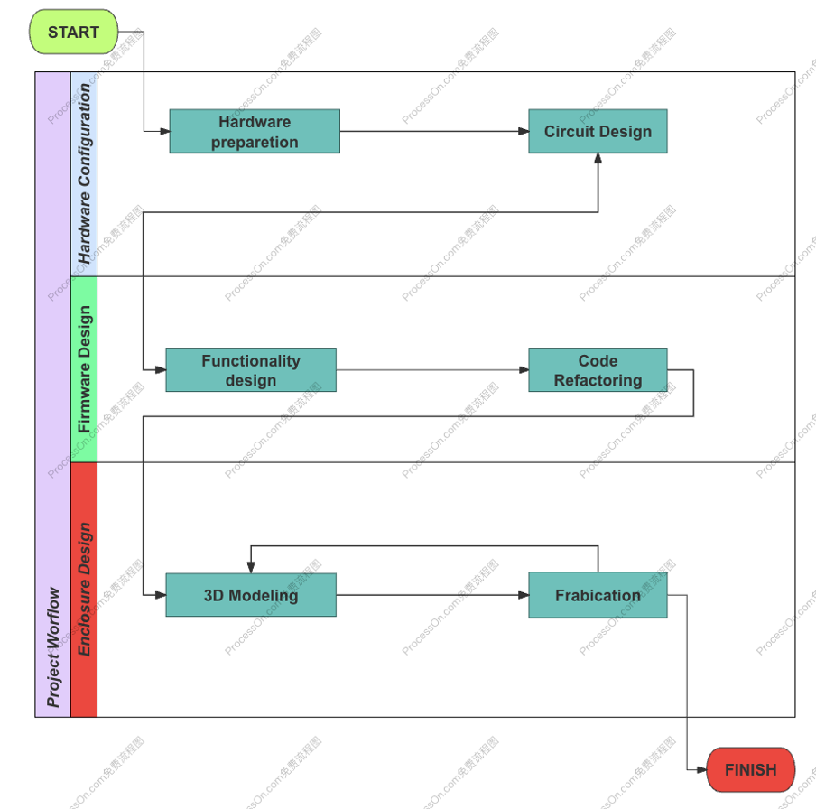

# CASA0016: Making, Designing & Building Connected Sensor Systems: NOVA
<p align="center">
  
</p>


## Table of Contents

1. [NOVA](#nova)
2. [Background](#Background)
3. [Board & Sensor](#board--sensor)
4. [System Design](#system-design)
5. [3D Modeling](#3d-modeling)
6. [Building Process](#building-process)
7. [Reflection](#reflection)

## <span style="color:blue;">N</span><span style="color:green;">O</span><span style="color:yellow;">V</span><span style="color:red;">A</span>  💡
<span style="color:blue;">N</span><span style="color:green;">O</span><span style="color:yellow;">V</span><span style="color:red;">A</span> is your personal "supernova" (without the explosions). Supernovas light up the universe, and NOVA lights up your desk—with less heat and chaos!

*What is <span style="color:blue;">N</span><span style="color:green;">O</span><span style="color:yellow;">V</span><span style="color:red;">A</span>  exactly?*

**NOVA is an intelligent lighting system that adapts to user preferences, visually reflecting real-time environmental data through dynamic light displays, seamlessly enhancing both functionality and ambiance in any workspace.**

## Background

### **Supernova**
Supernovas are explosive phenomena that occur when stars die, releasing massive energy in an instant, sometimes outshining entire galaxies. Drawing inspiration from this celestial event.

### Indoor Environmental Quality (IEQ)
Indoor Environmental Quality (IEQ) is a critical aspect of modern workspace design, focusing on creating environments that enhance well-being and productivity. Four critical domains IEQ focus: **Air Quality**, **Visual Comfort**, **Thermal Comfort**, **Acoustic Comfort**. Learn more at BRE [Indoor Environmental Quality](https://bre.ac/indoor-environmental-quality/).

### Calm Technology
Calm Technology represents a transformative approach in the digital realm, emphasizing minimalistic and seamless interactions with devices. It focuses on creating technology that supports users efficiently without constantly demanding their attention.

**References:**
- [Indoor Environmental Quality (BRE)](https://bre.ac/indoor-environmental-quality/)
- [Calm Technology (Calmtech)](https://calmtech.com/)


## **Highlight Features**
- **Visual Comfort**: Enhances your workspace experience with subtle lighting.
- **Calm Alerts**: Delivers notifications without causing distractions.
- **Customizability**: Allows personalized settings to suit your environment.

## Schematics
### **Hardware Configuration**
| Components         | Number | Description                                                                                                                                                                  | Link |
|---------------------|--------|----------------------------------------------------------------------------------------------------------------------------------------------------------------------------|------|
| Arduino Uno         | <div align="center">1</div>      | <div align="center">-</div>                                                                                                                                                 | [The Things Uno (Arduino Leonardo)](https://docs.arduino.cc/hardware/leonardo/)  |
| Rotary Encoder      | <div align="center">1</div>       | <div align="center">-</div>                                                                                                                                                 | [Rotary Encoder](https://wiki.seeedstudio.com/Grove-Rotary_Angle_Sensor/#platforms-supported)  |
| SCD30              | <div align="center">1</div>       | - **Temperature**<br>      - Unit: °C<br>   - Represents <span style="color:red;">**IEQ - Thermal comfort**</span><br><br>- **CO2**<br>     - Unit: ppm (parts per million)<br>   - Represents <span style="color:red;">**IEQ - Air quality**</span><br><br>- **Humidity**<br>      - Unit: %RH<br>   - Represents <span style="color:red;">**IEQ - Thermal comfort**</span> | [SCD30](https://learn.adafruit.com/adafruit-scd30)|
| NeoPixel Strip 60   | <div align="center">1</div>       | - Set the current environment data as default (<span style="color:green;">**green**</span>). If the data decreases, the LED shifts to <span style="color:blue;">**blue**</span>; if it increases, the LED shifts to <span style="color:yellow;">**yellow**</span>, eventually reaching <span style="color:red;">**red**</span>. <br> - Represents **IEQ - Visual comfort**| [LED](https://thepihut.com/products/flexible-rgb-led-strip-neopixel-ws2812-sk6812-compatible-60-led-meter)  |
| LCD 16x2            | <div align="center">1</div>       | Show real-time data                                                                                                                                                        | [LCD](https://docs.arduino.cc/learn/electronics/lcd-displays/)  |


## System Design

<p align="center">
  
</p>


The system operates with two main functionalities: **start/reset** and **initialization**. Users can either start fresh, reset the system, or directly interact with specific environmental parameters.

- **Reset Button**: Allows users to re-select the environmental parameter (CO2, temperature, or humidity) that the lighting system reflects.
- **Initialization**: Computes baseline values by collecting multiple environmental data points. Thresholds are automatically set based on these baselines.

---

**Thresholds Configuration:**

1. **CO2**:
   - Maximum Threshold: `init CO2 + 5000`
   - Minimum Threshold: Not applied (aligns with "Calm Technology" principles).

2. **Temperature**:
   - Range: `init temp - 15` to `init temp + 15`

3. **Humidity**:
   - Range: `init humid - 40` to `init humid + 40`

> **Manual Adjustment**: Users can fine-tune thresholds for more precise control.

---

**Data Visualization:**

1. **LCD Demonstration**:
   - Displays:
     - Processed data
     - Initialization results
     - Selected environmental parameters in real-time

2. **LED Logic**:
   - Dynamically changes LED colors to represent environmental data within defined ranges:
     - **Blue**: Indicates the lower range
     - **Green → Yellow**: Transition through mid-range values
     - **Red**: Indicates the upper limit


## 3D Modeling

### **Enclosure Design**
The 3D modeling design is inspired by the simple and recognizable lamp style from "Minecraft," bringing a touch of its blocky charm into the real world.
<p align="center">
  
</p>

## Building Process

### **Development Workflow**
NOVA operates with the following workflow:
1. **Hardware Configuration**: Integration of sensors and actuators.
2. **Firmware Design**: Coordination of data collection and alert mechanisms.
3. **Enclosure Design**: Building a robust and aesthetically pleasing housing.

<p align="center">
  
</p>

The project workflow begins with **hardware preparation**, including tasks such as soldering components, designing and testing circuits, and running iterative experiments to ensure the system's reliability. The hardware design phase provides a foundation for the **firmware design**, where functionality is defined and implemented.

A strong interaction between **code design** and **hardware design** drives the iterative process—code refactoring often requires hardware adjustments, while hardware updates demand changes in the firmware to align with new parameters or constraints. This feedback loop ensures seamless integration between the system's physical and logical components.

The **3D modeling phase**, which involved designing the enclosure to house the system, proved more time-consuming than initially anticipated due to the challenges of balancing aesthetics, functionality, and structural durability. The finalized model was then fabricated to complete the enclosure design. 

This iterative and collaborative process ultimately brought the project from concept to completion.

## Reflection

### Development Challenges
- Integrating multiple sensors while ensuring accurate data synchronization.
- Balancing visual comfort with energy efficiency in LED alerts.

### Observations on Sensing Limitations
- Environmental variables (like light intensity) can interfere with CO2 sensor readings.

### Unintended Consequences
- Users reported enhanced focus but occasionally relied on NOVA more than intended.

### Negative Consequences
- Prolonged exposure to LED lighting may cause mild eye strain in low-light conditions.
```